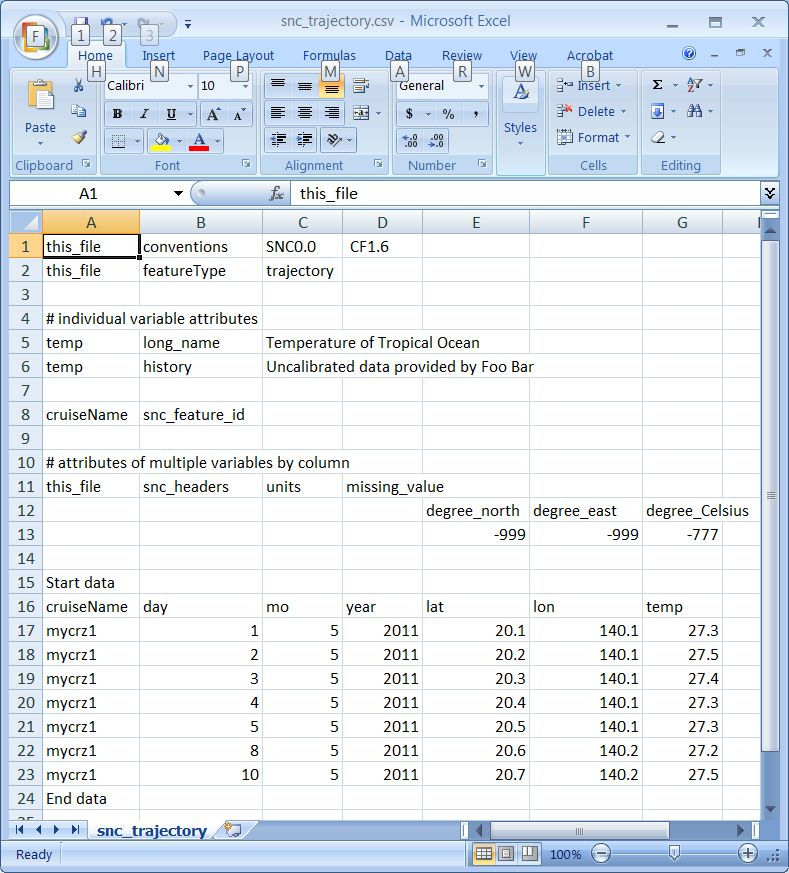

.. netcdf_csv documentation master file, created by
   sphinx-quickstart on Tue Apr 14 18:27:22 2015.

======================================
netcdf_csv Documentation
======================================

.. _start_of_TOC:

Table of Contents:
-------------------

.. toctree::
    :maxdepth: 2

    Datasets
    Variables
    Resources

.. _start_of_readme:

Readme
---------

netcdf_csv is being developed as a tool to move data between the netcdf format that is preferred by for data storage and archiving and the more user-friendly tab-separated value that allows users to examine data using spreadsheets.

netcdf_csv is a python module that will allow for quick conversion of a formatted spreadsheet into a python object that can be passed to the netCDF4 API.

.. _cs_section:

Current Status
----------------

netcdf_csv can now instantiate a new dataset from a formatted TSV file including variables, dimensions, and global attributes. Fill values are not currently loading into the dataset. Dimensions must be assigned by identifiying variables with dimensions.

.. _exd_section:

Example Data
-----------------
A basic spreadsheet will follow the format similar to that generated by ncdump:

|    this_file,conventions,SNC0.0, CF1.6
|    this_file,featureType,trajectory
|
|    # individual variable attributes
|    temp,long_name,"Temperature of Tropical Ocean"
|    temp,history,"Uncalibrated data provided by Foo Bar"
|
|    cruiseName,snc_feature_id
|
|    # attributes of multiple variables by column
|    this_file,snc_headers,units,missing_value
|    ,,,,degree_north,degree_east,degree_Celsius
|    ,,,,-999,-999,-777
|
|    Start data
|    cruiseName,day,mo,year,lat,lon,temp
|    mycrz1,1,5,2011,20.1,140.1,27.3
|    mycrz1,2,5,2011,20.2,140.1,27.5
|    mycrz1,3,5,2011,20.3,140.1,27.4
|    mycrz1,4,5,2011,20.4,140.1,27.3
|    mycrz1,5,5,2011,20.5,140.1,27.3
|    mycrz1,8,5,2011,20.6,140.2,27.2
|    mycrz1,10,5,2011,20.7,140.2,27.5
|    End data
|

This format allows for parsing in standard spreadsheet software:

.. _py_section:

Converting to a Python Object
------------------------------

A python object can be initialized from the formatted data using the class method readfromTSV

.. code-block:: python

    from netcdf_csv import snc_dataset as sd
    tfile = r'test/tdata/snc_trajectory.tsv'
    test_data = sd.Dataset.readfromTSV(tfile)

    # demo some class attributes that have been populated
    test_data.variables
    test_data.globals

    # variable objects held in dataset
    v = test_data.variables.get('lat')
    v.data_array

Return to the :ref:`Top of the Page <start_of_TOC>`

Indices and tables
-------------------

* :ref:`genindex`
* :ref:`modindex`
* :ref:`search`
